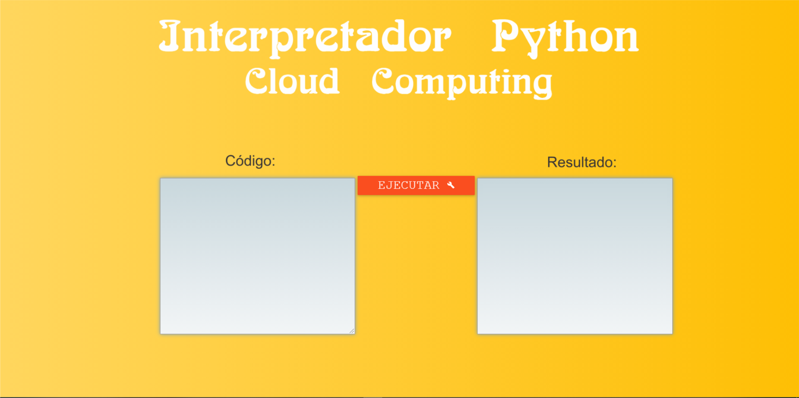

# Python Code - Execution Backend
Web para ejecutar código Python 

- Profesor: 
    - Dr. Alvaro Henry Mamani Aliaga 

- Estudiantes: 
    - Hayde Luzmila Humpire Cutipa
    - Larraondo Lamchog Alejandro Jesus 

## Requerimientos para la implementación
Los pasos que vamos a seguir para la implementación de nuestro  intepretador de python:
- Mediante un GET mostrar una página web que pida introducir un código para ejecutarlo.
- Mediante un POST entregamos al servido el código a ejecutar.
- Internamente el servidor traduce el código y lo ejecuta, almacenando los resultados.
- Devolvemos los resultados para ser impresos en la página web.

### Ejecución Interna
ython posee la función exec() que recibe código python en un string y lo ejecuta. Adicional a esto, debemos capturar las salidas que este código pueda generar, es por eso que utilizamos el sys.stdout para almacenar las salidas en un buffer.
    
```
import sys
import io

def executer(code):
    old_stdout = sys.stdout
    new_stdout = io.StringIO()
    sys.stdout = new_stdout

    exec(code)

    output = new_stdout.getvalue()

    sys.stdout = old_stdout
    return output
```

### Interfaz Web
Para realizar este trabajo utilizaremos Flask por su sencilla implementación. Solo será necesaria una ruta (/) que recibirá tanto métodos GET como POST. GET para cargar la página y POST para mandar al servidor el código a ejecutarse.

Como se ve en la línea 20, en el caso de que tengamos un método GET, se renderizará la página en blanco. En el caso de ser POST, primero mediante el request obtenemos el texto dentro del textarea code (Línea 14) y lo pasamos como parámetro en la función executer, la cuál nos retornará las salidas obtenidas. Finalmente renderizamos la página pasando como parámetros el resultado y el código (Línea 18). En la línea 24 asignamos el host 0.0.0.0 y puerto 8080.

```
from flask import Flask, render_template
from flask import request
from flask_material import Material

from executer import executer

app = Flask(__name__)
Material(app)


@app.route('/', methods=['GET', 'POST'])
def main():
    if request.method == 'POST':
        code = request.form['code']
        print("CÓDIGO:\n",code)
        printed = executer(code)
        print("RESULTADO:\n",printed)
        return render_template('index.html',result=printed,coded=code)
    else:
        return render_template('index.html')


if __name__=='__main__':
    app.run(use_reloader = True,debug = True, host= '0.0.0.0', port=8080)
```

## Google Cloud

### Compilación de la imagen de contenedor
Ahora es turno de desplegar el proyecto a un contenedor, para esto debemos empaquetarlo en un contenedor de Docker y posteriormente ejecutar esa imagen en un clúster, en este caso utilizaremos Google Kubernetes Engine (GKE).

Desde la Google Cloud Console lo primero que hay que hacer es obtener el proyecto, en este caso desde GitHub. 


Una vez hayamos descargado el proyecto, creamos el archivo Dockerfile donde especificaremos las librerias requeridas. Luego compilamos y etiquetamos la imagen de Docker Executer. Verificamos que la imagen haya sido creado:


```
FROM python:3.7
COPY . /app
WORKDIR /app
RUN pip3 install -r requirements.txt
ENTRYPOINT ["python3"]
CMD ["executerUI.py"]
```


Para probar que la imagen funcione correctamente la ejecutamos bajo el puerto 8080 mediante el motor de Docker local. 


Visualizamos mediante el navegador web.


### Envio de imagen de Doker a Conteiner Registry
Se debe subir la imagen de contenedor a un registro para que el clúster de GKE pueda descargarla y ejecutarla. Debemos configurar la herramienta de línea de comandos de Docker se autentique en Container Registry y posteriormente enviar la imagen de Docker que acabamos de compilar a Container Registry.


### Creación del Clúster GKE
Ahora que la imagen de Docker está almacenada en Container Registry, debemos crear un clúster de GKE para ejecutar Executer. Un clúster de GKE consiste en un grupo de instancias de VM de Compute Engine que ejecutan Kubernetes, el sistema de organización de clústeres de código abierto que se usa en GKE.

Primero debemos configurar las opciones del ID del proyecto y de la zona de Compute Engine para la herramienta de gcloud, posteriormente creamos el clúster executer-cluster.


Una vez que se complete el comando, ya podremos ver las tres instancias de VM de trabajador del clúster:


### Implementación de la app en GKE
Kubernetes representa las aplicaciones como Pods, que son unidades escalables que contienen uno o más contenedores. Un Pod es la unidad más pequeña que se puede implementar en Kubernetes. Por lo general, implementas los Pods como un conjunto de réplicas que se pueden escalar y distribuir juntas en el clúster. Una forma de implementar un conjunto de réplicas es mediante una implementación de Kubernetes.

Creamos una implementación de Kubernetes para ejecutar Executer en el clúster. Esta implementación tendrá 3 réplicas (Pods). Un Pod de la implementación contendrá solo un contenedor: la imagen de Docker de execute}. También crearemos un recurso HorizontalPodAutoscaler que escalará la cantidad de Pods de 3 a un número entre 1 y 5, en función de la carga de CPU. En caso no haya una carga elevada, los pods no utilizados serán desactivados.


Si bien los Pods tienen direcciones IP asignadas de forma individual, solo se puede acceder a estas desde el interior del clúster. Además, los Pods de GKE están diseñados para ser efímeros y disminuir o aumentar en función de las necesidades de escalamiento. Cuando un Pod falla debido a un error, GKE volverá a implementarlo de forma automática y le asignará una dirección IP nueva cada vez que esto suceda.

Esto significa que, en cualquier implementación, el conjunto de direcciones IP correspondiente al conjunto activo de Pods es dinámico. Necesitamos una forma de: 1) agrupar los Pods en un nombre de host estático y 2) exponer un grupo de Pods fuera del clúster a la Internet.

Los Servicios de Kubernetes resuelven estos dos problemas. Los servicios agrupan los Pods en una dirección IP estática, a la que se puede acceder desde cualquier Pod dentro del clúster. GKE también asigna un nombre de host de DNS a esa IP estática: por ejemplo, hello-app.default.svc.cluster.local.

El tipo de servicio predeterminado en GKE se llama ClusterIP. En este tipo, el servicio obtiene una dirección IP a la que solo se puede acceder desde interior del clúster. Para exponer un servicio de Kubernetes fuera del clúster, deberemos crear un servicio de tipo LoadBalancer. Este tipo de servicio genera una IP del balanceador de cargas externo para un conjunto de Pods, a la que se puede acceder a través de Internet.


Finalmente accedemos la dirección EXTERNAL\_IP  (por ejemplo, 34.95.142.156) y podremos ejecutar la aplicación Executer:


